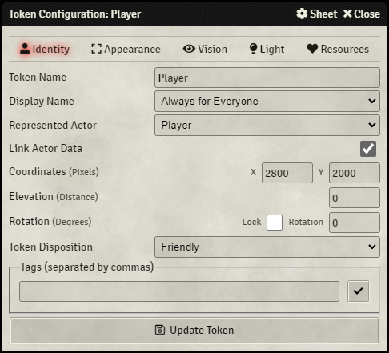

# Tagger

This module allows you to tag PlaceableObjects and retrieve them just as easy.

## Download

`https://github.com/Haxxer/FoundryVTT-Tagger/releases/latest/download/module.json`

## Dialogs

All major PlaceableObjects' configuration dialogues (such as actor prototype tokens, tokens, tiles, walls, lights, etc), now has a "Tags" field.

Each tag is separated by a comma.



## Documentation

### Get By Tag
Gets PlaceableObjects with matching tags provided to the method.

`Tagger.getByTag(string|array, options={})`

```
@param    {string|array}     inTags      An array of tags or a string of tags (separated by commas) that will be searched for
@param    {object}           inOptions   An optional object that can contain any of the following:
                                             - matchAll {boolean}        - whether the PlaceableObjects must contain all of the provided tags
                                             - caseInsensitive {boolean} - whether the search is case insensitive (capitals vs lowercase is not considered)
                                             - objects {array}           - an array of PlaceableObjects to test
                                             - ignore {array}            - an array of PlaceableObjects to ignore
                                             - sceneId {string}          - a string ID for the scene to search in

@returns  {Promise}                      A promise that will resolve when all PlaceableObjects have been found, returning an array of PlaceableObjects
```

Examples:

- `Tagger.getByTag("tags")`
- `Tagger.getByTag("tags, TO, LOOK, foR", { caseInsensitive: true })`
- `Tagger.getByTag(["tags", "to", "look", "for"], { matchAll: true, sceneId: "8xjy4UUVoRcEYUNy" })`

### Get Tags
Gets all tags from a given PlaceableObject

`Tagger.getTags(PlaceableObject)`

```
@param    {PlaceableObject}  inObject    The PlaceableObject get tags from

@returns  {array}                        An array of tags from the PlaceableObject
```

### Set Tags

Set the tags on an PlaceableObject

`Tagger.setTags(PlaceableObject|array, string|array)`

```
@param    {PlaceableObject|array}    inObjects   A PlaceableObject or an array of PlaceableObjects to set tags on
@param    {string|array}             inTags      An array of tags or a string of tags (separated by commas) that will override all tags on the PlaceableObjects

@returns  {promise}                              A promise that will resolve when the PlaceableObjects' tags have been updated

```

### Add Tags

Adds tags to an PlaceableObject

`Tagger.addTags(PlaceableObject|array, string|array)`

```
@param    {PlaceableObject|array}    inObjects   A PlaceableObject or an array of PlaceableObjects to add tags to
@param    {string|array}             inTags      An array of tags or a string of tags (separated by commas) that will be added to the PlaceableObjects

@returns  {promise}                              A promise that will resolve when the tags have been updated
```

### Remove Tags

Removes tags from an PlaceableObject

`Tagger.removeTags(PlaceableObject|array, string|array)`

```
@param    {PlaceableObject|array}    inObjects   A PlaceableObject or an array of PlaceableObjects to remove tags from
@param    {string|array}             inTags      An array of tags or a string of tags (separated by commas) that will be removed from the PlaceableObjects

@returns  {promise}                              A promise that will resolve when the tags have been updated
```

### Clear All Tags

Removes all tags from an PlaceableObject

`Tagger.clearAllTags(PlaceableObject|array)`

```
@param    {PlaceableObject|array}    inObjects   The PlaceableObjects to remove all tags from

@returns  {promise}                              A promise that will resolve when the tags have been updated
```
